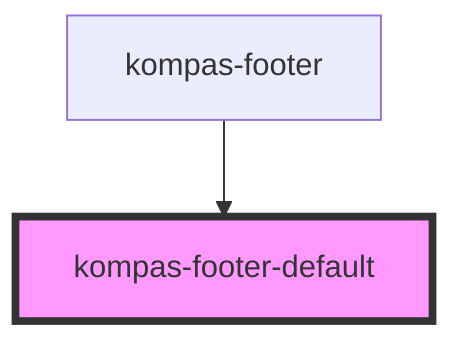

# kompas-footer-default

<!-- Auto Generated Below -->

## Properties

| Property             | Attribute | Description                                                 | Type  | Default     |
| -------------------- | --------- | ----------------------------------------------------------- | ----- | ----------- |
| `menus` _(required)_ | `menus`   | Rubrik/kategori artikel, pisahkan tiap item dengan koma (,) | `any` | `undefined` |

## Dependencies

### Used by

 - [kompas-footer](../kompas-footer)

### Graph

----------------------------------------------

*Terbikin oleh tim front-end kompas.id*
