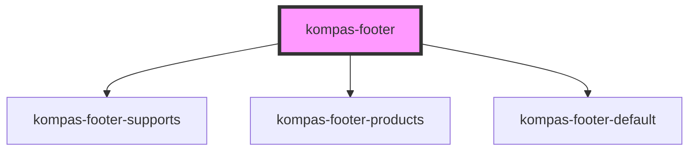

# kompas-footer

Ini adalah komponen bagian _footer_ halaman khas produk-produk digital berbasis web Kompas.

## Pemasangan

### CDN

Selalu menggunakan versi terbaru:
```html
<script src="https://unpkg.com/@kompas/web-components@latest" type="module" async defer></script>
```
atau menggunakan versi tertentu, saat ini belum disarankan:
```html
<script src="https://unpkg.com/@kompas/web-components@0.0.1-alpha-5" type="module" async defer></script>
```

### NPM
```bash
npm i -D @kompas/web-components
```

### Yarn
```bash
yarn add -D @kompas/web-components
```

## Penggunaan

### Standar
Anda hanya perlu meletakkan _tag_ komponen  `<kompas-footer />` secara manasuka di halaman (lebih disukai di akhir halaman).

### Vue.js
Apabila menggunakan Vue.js sebagai kerangka kerja Javascript, Anda perlu menambahkan konfigurasi berikut di `./src/main.js`:

```javascript
import Vue from "vue";
import App from "./App.vue";

import {
  applyPolyfills,
  defineCustomElements,
} from "@kompas/web-components/loader";

Vue.config.productionTip = false;

// Perintahkan Vue untuk mengabaikan komponen dengan prefiks 'kompas-'
Vue.config.ignoredElements = [/kompas-\w*/];

// Bebat komponen kustom ke obyek window
applyPolyfills().then(() => {
  defineCustomElements();
});

new Vue({
  render: (h) => h(App),
}).$mount("#app");
```

### NuxtJS
Apabila menggunakan NuxtJS, Anda bisa menggunakan pustaka [Gomah/nuxt-stencil](https://github.com/Gomah/nuxt-stencil). Tugas selanjutnya adalah menambahkan konfigurasi berikut di `nuxt.config.js`:

```javascript
export default {
  modules: [
    'nuxt-stencil'
  ],
  stencil: {
    lib: '@kompas/web-components',
    prefix: 'kompas-',
    renderOptions: {},
    hydratePath: '@kompas/web-components/hydrate',
    loaderPath: '@kompas/web-components/loader',
    ignoredElements: null
  },
}
```


<!-- Auto Generated Below -->


## Properties

| Property         | Attribute         | Description                         | Type     | Default                                           |
| ---------------- | ----------------- | ----------------------------------- | -------- | ------------------------------------------------- |
| `wordingMessage` | `wording-message` | wording untuk chat whatsapp & email | `string` | `'Halo, saya perlu informasi mengenai kompas.id'` |


## Dependencies

### Depends on

- [kompas-footer-supports](../kompas-footer-supports)
- [kompas-footer-products](../kompas-footer-products)
- [kompas-footer-default](../kompas-footer-default)

### Graph


----------------------------------------------

*Terbikin oleh tim front-end kompas.id*
