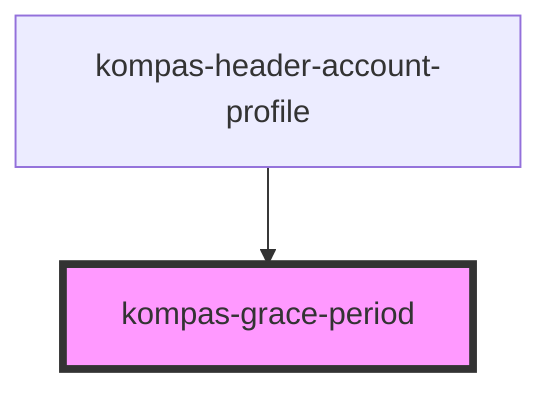

# kid-grace-period

<!-- Auto Generated Below -->

## Properties

| Property                      | Attribute            | Description                                                           | Type      | Default     |
| ----------------------------- | -------------------- | --------------------------------------------------------------------- | --------- | ----------- |
| `isColoumn`                   | `is-coloumn`         | prop isColoumn untuk merubah flex-column pada header account profile  | `boolean` | `false`     |
| `isShowButton`                | `is-show-button`     | prop isShowButton untuk nampilin button perbarui langganan            | `boolean` | `false`     |
| `subscriptionId` _(required)_ | `subscription-id`    | prop subscriptionId untuk renewal subs.                               | `any`     | `undefined` |
| `totalGracePeriod`            | `total-grace-period` | prop totalGracePeriod untuk menghitung berapa hari grace period user. | `number`  | `0`         |

## Dependencies

### Used by

 - [kompas-header-account-profile](../kompas-header-account-profile)

### Graph

----------------------------------------------

*Terbikin oleh tim front-end kompas.id*
