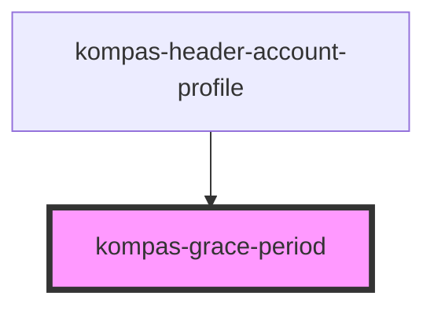

# kid-grace-period

<!-- Auto Generated Below -->

## Properties

| Property           | Attribute            | Description                                                           | Type     | Default |
| ------------------ | -------------------- | --------------------------------------------------------------------- | -------- | ------- |
| `totalGracePeriod` | `total-grace-period` | prop totalGracePeriod untuk menghitung berapa hari grace period user. | `number` | `0`     |

## Dependencies

### Used by

 - [kompas-header-account-profile](../kompas-header-account-profile)

### Graph

----------------------------------------------

*Terbikin oleh tim front-end kompas.id*
