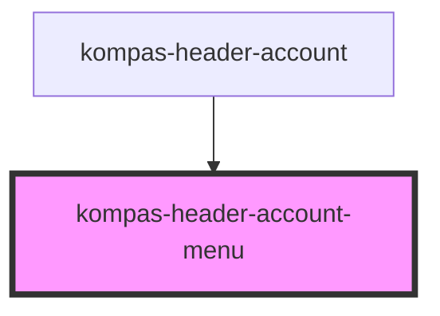

# kompas-header-account-menu

Prefer to define it on ENV. so it can be easily changed domain (local, development, or production)

<!-- Auto Generated Below -->

## Properties

| Property            | Attribute            | Description              | Type     | Default                                                   |
| ------------------- | -------------------- | ------------------------ | -------- | --------------------------------------------------------- |
| `cartUrl`           | `cart-url`           | Cart Url                 | `string` | `'https://gerai.kompas.id/cart'`                          |
| `logoutUrl`         | `logout-url`         | Logout Url               | `string` | `'https://account.kompas.id/logout'`                      |
| `manageAccountUrl`  | `manage-account-url` | Manage Account Url       | `string` | `'https://account.kompas.id/manage-account/my-account'`   |
| `notificationTotal` | `notification-total` | Total Notification Count | `number` | `0`                                                       |
| `notificationUrl`   | `notification-url`   | Notification Url         | `string` | `'https://account.kompas.id/manage-account/notification'` |
| `ordersUrl`         | `orders-url`         | Orders Url               | `string` | `'https://gerai.kompas.id/my-account/orders'`             |

## Dependencies

### Used by

 - [kompas-header-account](../kompas-header-account)

### Graph

----------------------------------------------

*Terbikin oleh tim front-end kompas.id*
