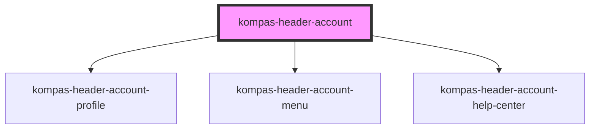

# kompas-header-account

Ini adalah komponen bagian _header_ halaman khas produk-produk digital berbasis web Kompas.

## Pemasangan

### - CDN

Selalu menggunakan versi terbaru:
```html
<script src="https://unpkg.com/@kompas/web-components@latest" type="module" async defer></script>
```
atau menggunakan versi tertentu, saat ini belum disarankan:
```html
<script src="https://unpkg.com/@kompas/web-components@0.0.1-alpha-5" type="module" async defer></script>
```

### - NPM
```bash
npm i -D @kompas/web-components
```

### - Yarn
```bash
yarn add -D @kompas/web-components
```

## Penggunaan

### - Vue.js
Apabila menggunakan Vue.js sebagai kerangka kerja Javascript, Anda perlu menambahkan konfigurasi berikut di `./src/main.js`:

```javascript
import Vue from "vue";
import App from "./App.vue";

import {
  applyPolyfills,
  defineCustomElements,
} from "@kompas/web-components/loader";

Vue.config.productionTip = false;

// Perintahkan Vue untuk mengabaikan komponen dengan prefiks 'kompas-'
Vue.config.ignoredElements = [/kompas-\w*/];

// Bebat komponen kustom ke obyek window
applyPolyfills().then(() => {
  defineCustomElements();
});

new Vue({
  render: (h) => h(App),
}).$mount("#app");
```

### - NuxtJS
Apabila menggunakan NuxtJS, Anda bisa menggunakan pustaka [Gomah/nuxt-stencil](https://github.com/Gomah/nuxt-stencil). Tugas selanjutnya adalah menambahkan konfigurasi berikut di `nuxt.config.js`:

```javascript
export default {
  modules: [
    'nuxt-stencil'
  ],
  stencil: {
    lib: '@kompas/web-components',
    prefix: 'kompas-',
    renderOptions: {},
    hydratePath: '@kompas/web-components/hydrate',
    loaderPath: '@kompas/web-components/loader',
    ignoredElements: null
  },
}
```

### Standar
Anda perlu meletakkan _tag_ komponen `<kompas-header-account />` pada halaman anda 
(Lebih disarankan untuk meletakkan pada bagian header).

Contoh:


### Elemen
```javascript
<kompas-header-account 
  sidebar-top-spacing=48
  notification-total=10
  logout-url="/logout"
  manage-account-url="/manage-count"
/>
```

### Catatan

Untuk property `user-data`, dikarenakan tipe data yang dikirim adalah _non-primitive_
Pada Penggunaan komponen ini di javascript vanilla (tanpa framework). 
Disarankan untuk menggunakan code seperti dibawah ini.

```javascript
document.querySelector('kompas-header-account').setAttribute('user-data', JSON.stringify({
  "userName" : "User Fullname",
  "expired" : "Berakhir: 6 hari lagi",
  "activeInfo" : "Aktif Berlangganan",
  "isMembership": true,
  "updateMembership" : "Perbarui Langganan",
})
```

<!-- Auto Generated Below -->


## Properties

| Property                | Attribute             | Description                                                    | Type     | Default     |
| ----------------------- | --------------------- | -------------------------------------------------------------- | -------- | ----------- |
| `cartUrl`               | `cart-url`            | Cart Url                                                       | `string` | `undefined` |
| `logoutUrl`             | `logout-url`          | Logout Url                                                     | `string` | `undefined` |
| `manageAccountUrl`      | `manage-account-url`  | Manage Account Url                                             | `string` | `undefined` |
| `notificationTotal`     | `notification-total`  | Total Notification Count                                       | `number` | `0`         |
| `notificationUrl`       | `notification-url`    | Notification Url                                               | `string` | `undefined` |
| `ordersUrl`             | `orders-url`          | Orders Url                                                     | `string` | `undefined` |
| `sidebarTopSpacing`     | `sidebar-top-spacing` | Value to Add spacing on top of sidebar (will convert to pixel) | `number` | `0`         |
| `subscriptionUrl`       | `subscription-url`    | Subscription Url                                               | `string` | `undefined` |
| `userData` _(required)_ | `user-data`           | Value consist of User Data                                     | `any`    | `undefined` |


## Dependencies

### Depends on

- [kompas-header-account-profile](../kompas-header-account-profile)
- [kompas-header-account-menu](../kompas-header-account-menu)
- [kompas-header-account-help-center](../kompas-header-account-help-center)

### Graph


----------------------------------------------

*Terbikin oleh tim front-end kompas.id*
