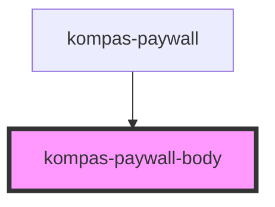

# kompas-paywall-body

<!-- Auto Generated Below -->

## Properties

| Property             | Attribute             | Description | Type                    | Default     |
| -------------------- | --------------------- | ----------- | ----------------------- | ----------- |
| `isLogin`            | `is-login`            |             | `boolean`               | `false`     |
| `paywallData`        | --                    |             | `PaywallProduct`        | `undefined` |
| `slug`               | `slug`                |             | `string`                | `""`        |
| `subscriptionStatus` | `subscription-status` |             | `string`                | `''`        |
| `type`               | `type`                |             | `"epaper" \| "reguler"` | `'reguler'` |
| `userGuid`           | `user-guid`           |             | `string`                | `''`        |

## Dependencies

### Used by

 - [kompas-paywall](../kompas-paywall)

### Graph

----------------------------------------------

*Terbikin oleh tim front-end kompas.id*
