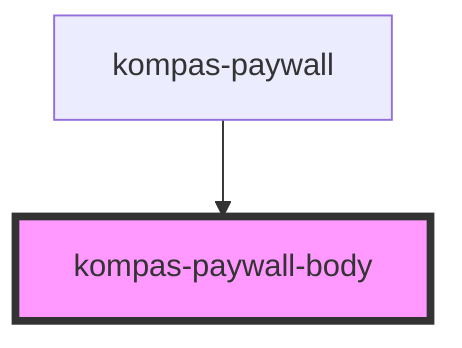

# kompas-paywall-body

<!-- Auto Generated Below -->

## Properties

| Property                       | Attribute                      | Description | Type                    | Default     |
| ------------------------------ | ------------------------------ | ----------- | ----------------------- | ----------- |
| `countdownArticle`             | `countdown-article`            |             | `number`                | `0`         |
| `isLogin`                      | `is-login`                     |             | `boolean`               | `false`     |
| `paywallData`                  | --                             |             | `PaywallProduct`        | `undefined` |
| `paywall_location`             | `paywall_location`             |             | `string`                | `''`        |
| `paywall_position`             | `paywall_position`             |             | `number`                | `0`         |
| `paywall_subscription_id`      | `paywall_subscription_id`      |             | `number`                | `0`         |
| `paywall_subscription_package` | `paywall_subscription_package` |             | `number`                | `0`         |
| `paywall_subscription_price`   | `paywall_subscription_price`   |             | `number`                | `0`         |
| `slug`                         | `slug`                         |             | `string`                | `""`        |
| `subscriptionStatus`           | `subscription-status`          |             | `string`                | `''`        |
| `swgEnable`                    | `swg-enable`                   |             | `boolean`               | `false`     |
| `tracker_content_category`     | `tracker_content_category`     |             | `string`                | `''`        |
| `tracker_content_id`           | `tracker_content_id`           |             | `string`                | `''`        |
| `tracker_content_title`        | `tracker_content_title`        |             | `string`                | `''`        |
| `tracker_content_type`         | `tracker_content_type`         |             | `string`                | `''`        |
| `tracker_metered_wall_balance` | `tracker_metered_wall_balance` |             | `number`                | `0`         |
| `tracker_metered_wall_type`    | `tracker_metered_wall_type`    |             | `string`                | `''`        |
| `tracker_page_domain`          | `tracker_page_domain`          |             | `string`                | `''`        |
| `tracker_page_type`            | `tracker_page_type`            |             | `string`                | `''`        |
| `tracker_subscription_status`  | `tracker_subscription_status`  |             | `string`                | `''`        |
| `tracker_user_type`            | `tracker_user_type`            |             | `string`                | `''`        |
| `type`                         | `type`                         |             | `"epaper" \| "reguler"` | `'reguler'` |
| `userGuid`                     | `user-guid`                    |             | `string`                | `''`        |

## Dependencies

### Used by

 - [kompas-paywall](../kompas-paywall)

### Graph

----------------------------------------------

*Terbikin oleh tim front-end kompas.id*
