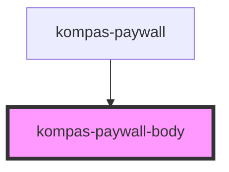

# kompas-paywall-body

<!-- Auto Generated Below -->

## Properties

| Property                       | Attribute                      | Description | Type                    | Default     |
| ------------------------------ | ------------------------------ | ----------- | ----------------------- | ----------- |
| `content_category`             | `content_category`             |             | `string`                | `''`        |
| `content_id`                   | `content_id`                   |             | `string`                | `''`        |
| `content_title`                | `content_title`                |             | `string`                | `''`        |
| `content_type`                 | `content_type`                 |             | `string`                | `''`        |
| `countdownArticle`             | `countdown-article`            |             | `number`                | `0`         |
| `epaper_edition`               | `epaper_edition`               |             | `string`                | `''`        |
| `isLogin`                      | `is-login`                     |             | `boolean`               | `false`     |
| `metered_wall_balance`         | `metered_wall_balance`         |             | `number`                | `0`         |
| `metered_wall_type`            | `metered_wall_type`            |             | `string`                | `''`        |
| `page_domain`                  | `page_domain`                  |             | `string`                | `''`        |
| `page_type`                    | `page_type`                    |             | `string`                | `''`        |
| `paywallData`                  | --                             |             | `PaywallProduct`        | `undefined` |
| `paywall_location`             | `paywall_location`             |             | `string`                | `''`        |
| `paywall_position`             | `paywall_position`             |             | `string`                | `''`        |
| `paywall_subscription_id`      | `paywall_subscription_id`      |             | `number`                | `0`         |
| `paywall_subscription_package` | `paywall_subscription_package` |             | `string`                | `''`        |
| `paywall_subscription_price`   | `paywall_subscription_price`   |             | `number`                | `0`         |
| `slug`                         | `slug`                         |             | `string`                | `""`        |
| `subscriptionStatus`           | `subscription-status`          |             | `string`                | `''`        |
| `subscription_status`          | `subscription_status`          |             | `string`                | `''`        |
| `swgEnable`                    | `swg-enable`                   |             | `boolean`               | `false`     |
| `type`                         | `type`                         |             | `"epaper" \| "reguler"` | `'reguler'` |
| `userGuid`                     | `user-guid`                    |             | `string`                | `''`        |
| `user_type`                    | `user_type`                    |             | `string`                | `''`        |

## Dependencies

### Used by

 - [kompas-paywall](../kompas-paywall)

### Graph

----------------------------------------------

*Terbikin oleh tim front-end kompas.id*
