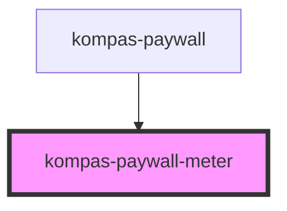

# kompas-paywall-meter

<!-- Auto Generated Below -->

## Properties

| Property           | Attribute           | Description                                                                        | Type     | Default |
| ------------------ | ------------------- | ---------------------------------------------------------------------------------- | -------- | ------- |
| `countdownArticle` | `countdown-article` | prop countdownArticle untuk menghandle sudah berapa artikel gratis yang user baca. | `number` | `0`     |

## Dependencies

### Used by

 - [kompas-paywall](../kompas-paywall)

### Graph

----------------------------------------------

*Terbikin oleh tim front-end kompas.id*
