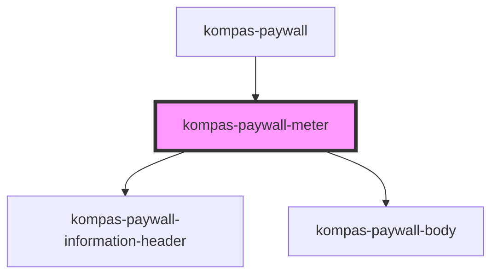

# kompas-paywall-meter

<!-- Auto Generated Below -->

## Properties

| Property           | Attribute           | Description                                                                        | Type                    | Default     |
| ------------------ | ------------------- | ---------------------------------------------------------------------------------- | ----------------------- | ----------- |
| `countdownArticle` | `countdown-article` | prop countdownArticle untuk menghandle sudah berapa artikel gratis yang user baca. | `number`                | `0`         |
| `isLogin`          | `is-login`          |                                                                                    | `boolean`               | `false`     |
| `type`             | `type`              |                                                                                    | `"epaper" \| "reguler"` | `'reguler'` |

## Dependencies

### Used by

 - [kompas-paywall](../kompas-paywall)

### Depends on

- [kompas-paywall-information-header](../kompas-paywall-information-header)
- [kompas-paywall-body](../kompas-paywall-body)

### Graph

----------------------------------------------

*Terbikin oleh tim front-end kompas.id*
