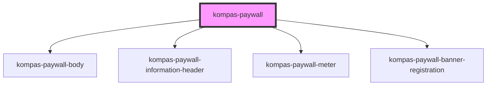

# kompas-paywall

<!-- Auto Generated Below -->

## Properties

| Property      | Attribute      | Description | Type                    | Default     |
| ------------- | -------------- | ----------- | ----------------------- | ----------- |
| `isLogin`     | `is-login`     |             | `boolean`               | `false`     |
| `isSubscribe` | `is-subscribe` |             | `boolean`               | `false`     |
| `quota`       | `quota`        |             | `number`                | `0`         |
| `type`        | `type`         |             | `"epaper" \| "reguler"` | `'reguler'` |

## Dependencies

### Depends on

- [kompas-paywall-body](../kompas-paywall-body)
- [kompas-paywall-information-header](../kompas-paywall-information-header)
- [kompas-paywall-meter](../kompas-paywall-meter)
- [kompas-paywall-banner-registration](../kompas-paywall-banner-registration)

### Graph

----------------------------------------------

*Terbikin oleh tim front-end kompas.id*
