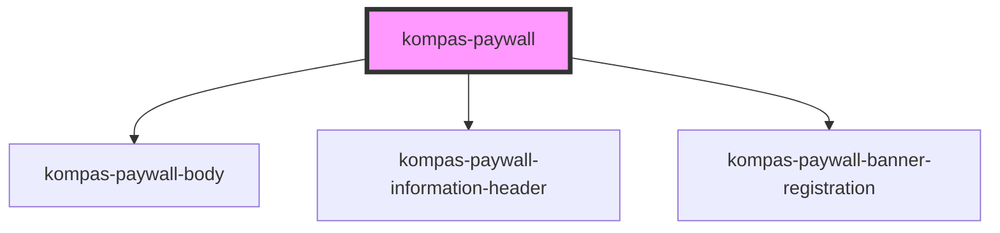

# kompas-paywall

Ini adalah redesign komponen _paywall_ yang digunakan pada [epaper.kompas.id](https://epaper.kompas.id) dan [kompas.id](https://kompas.id).  Penggunaan komponen ini dapat dibedakan berdasarkan type productnya ( epaper atau reguler(kompas.id)). 

## Pemasangan

### - CDN

Selalu menggunakan versi terbaru:
```html
<script src="https://unpkg.com/@kompas/web-components@latest" type="module" async defer></script>
```
atau menggunakan versi tertentu, saat ini belum disarankan:
```html
<script src="https://unpkg.com/@kompas/web-components@0.0.1-alpha-5" type="module" async defer></script>
```

### - NPM
```bash
npm i -D @kompas/web-components
```

### - Yarn
```bash
yarn add -D @kompas/web-components
```

## Penggunaan

### - Vue.js
Apabila menggunakan Vue.js sebagai kerangka kerja Javascript, Anda perlu menambahkan konfigurasi berikut di `./src/main.js`:

```javascript
import Vue from "vue";
import App from "./App.vue";

import {
  applyPolyfills,
  defineCustomElements,
} from "@kompas/web-components/loader";

Vue.config.productionTip = false;

// Perintahkan Vue untuk mengabaikan komponen dengan prefiks 'kompas-'
Vue.config.ignoredElements = [/kompas-\w*/];

// Bebat komponen kustom ke obyek window
applyPolyfills().then(() => {
  defineCustomElements();
});

new Vue({
  render: (h) => h(App),
}).$mount("#app");
```

### - NuxtJS
Apabila menggunakan NuxtJS, Anda bisa menggunakan pustaka [Gomah/nuxt-stencil](https://github.com/Gomah/nuxt-stencil). Tugas selanjutnya adalah menambahkan konfigurasi berikut di `nuxt.config.js`:

```javascript
export default {
  modules: [
    'nuxt-stencil'
  ],
  stencil: {
    lib: '@kompas/web-components',
    prefix: 'kompas-',
    renderOptions: {},
    hydratePath: '@kompas/web-components/hydrate',
    loaderPath: '@kompas/web-components/loader',
    ignoredElements: null
  },
}
```

### Standar
Anda perlu meletakkan _tag_ komponen `<kompas-paywall />` pada halaman anda.

Contoh:


### Elemen
```javascript
<kompas-paywall 
  type="reguler" 
  is-with-header="true"
  header-text="this is defult text message"
/>
```

### Catatan

Kompas Paywall ini terdiri dari beberapa sub-komponen sebagai berikut : 

1. kompas-paywall-body <br>
  sub-komponen ini merupakan bagian paywall body yang memiliki dua tipe yaitu _epaper_ dan _reguler_ 
  <br>
    * epaper <br>
  
    * reguler <br>
  

2. kompas-paywall-banner-registration <br>
  sub-komponen ini merupakan komponen banner registration user <br>
  
  
3. kompas-paywall-information-header <br>
  sub-komponen ini merupakan komponen yang digunakan pada mettered paywall ketika mencapai kuota maksimal <br>
  

<!-- Auto Generated Below -->


## Properties

| Property                       | Attribute                      | Description | Type                    | Default     |
| ------------------------------ | ------------------------------ | ----------- | ----------------------- | ----------- |
| `countdownArticle`             | `countdown-article`            |             | `number`                | `0`         |
| `isLogin`                      | `is-login`                     |             | `boolean`               | `false`     |
| `isWithHeader`                 | `is-with-header`               |             | `boolean`               | `false`     |
| `paywall_location`             | `paywall_location`             |             | `string`                | `''`        |
| `paywall_position`             | `paywall_position`             |             | `number`                | `0`         |
| `paywall_subscription_id`      | `paywall_subscription_id`      |             | `number`                | `0`         |
| `paywall_subscription_package` | `paywall_subscription_package` |             | `number`                | `0`         |
| `paywall_subscription_price`   | `paywall_subscription_price`   |             | `number`                | `0`         |
| `subscriptionStatus`           | `subscription-status`          |             | `string`                | `''`        |
| `swgEnable`                    | `swg-enable`                   |             | `boolean`               | `false`     |
| `textHeader`                   | `text-header`                  |             | `string`                | `''`        |
| `tracker_content_category`     | `tracker_content_category`     |             | `string`                | `''`        |
| `tracker_content_id`           | `tracker_content_id`           |             | `string`                | `''`        |
| `tracker_content_title`        | `tracker_content_title`        |             | `string`                | `''`        |
| `tracker_content_type`         | `tracker_content_type`         |             | `string`                | `''`        |
| `tracker_metered_wall_balance` | `tracker_metered_wall_balance` |             | `number`                | `0`         |
| `tracker_metered_wall_type`    | `tracker_metered_wall_type`    |             | `string`                | `''`        |
| `tracker_page_domain`          | `tracker_page_domain`          |             | `string`                | `''`        |
| `tracker_page_type`            | `tracker_page_type`            |             | `string`                | `''`        |
| `tracker_subscription_status`  | `tracker_subscription_status`  |             | `string`                | `''`        |
| `tracker_user_type`            | `tracker_user_type`            |             | `string`                | `''`        |
| `type`                         | `type`                         |             | `"epaper" \| "reguler"` | `'reguler'` |
| `userGuid`                     | `user-guid`                    |             | `string`                | `''`        |


## Dependencies

### Depends on

- [kompas-paywall-body](../kompas-paywall-body)
- [kompas-paywall-information-header](../kompas-paywall-information-header)
- [kompas-paywall-banner-registration](../kompas-paywall-banner-registration)

### Graph


----------------------------------------------

*Terbikin oleh tim front-end kompas.id*
